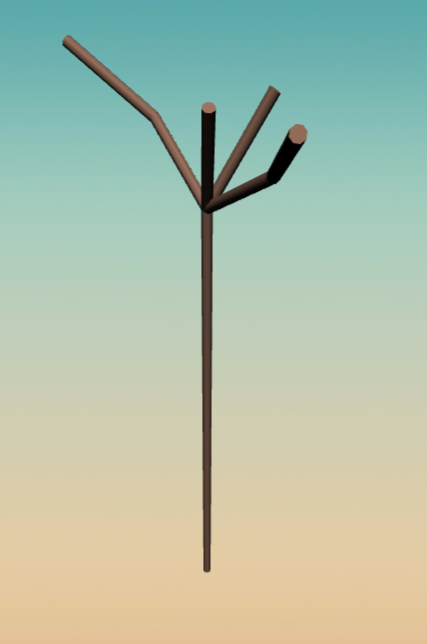
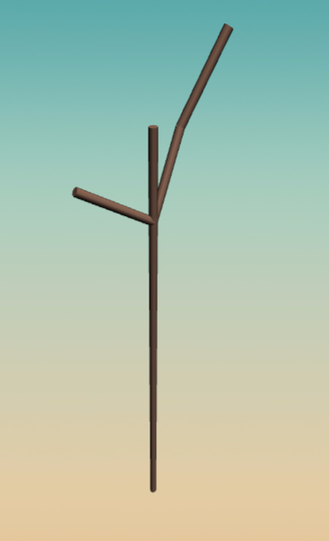
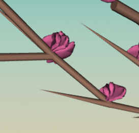
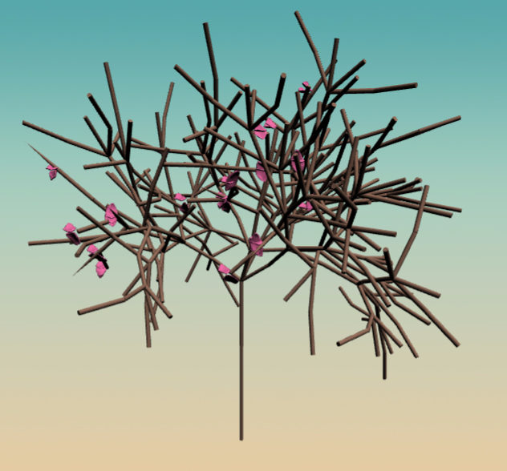
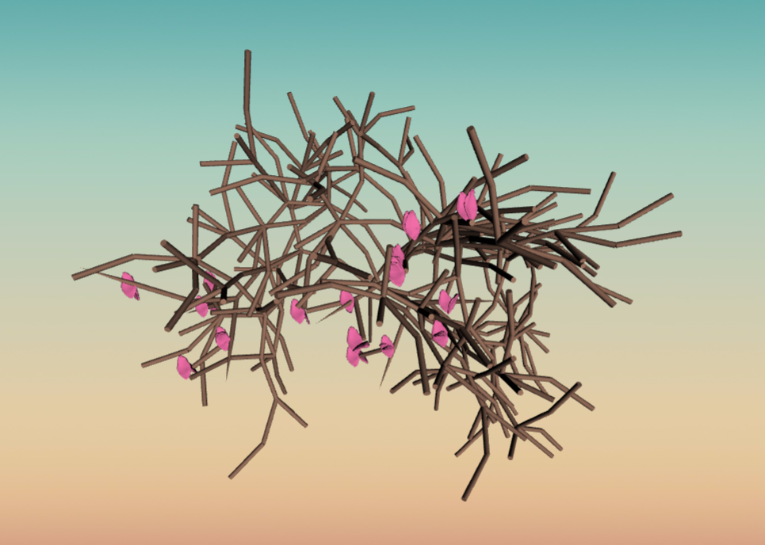
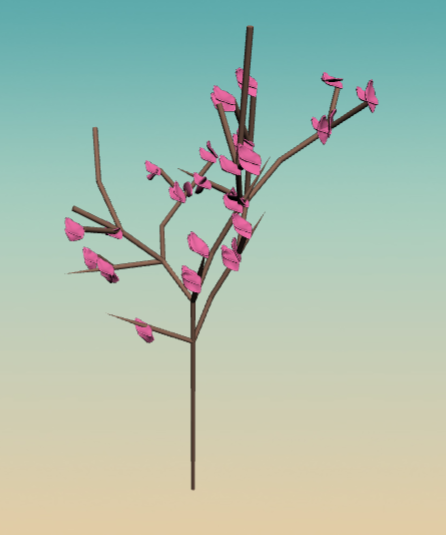
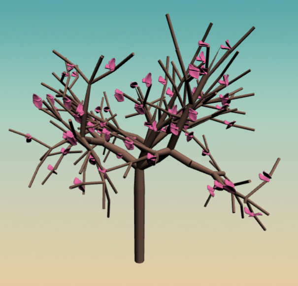
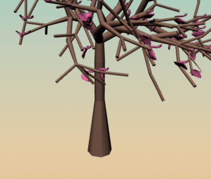

# L-System Parser- Cherry Blossom Tree

I have implemented an L-system parser as well as a grammar to create a cherry blossom tree. It can be found at https://tabathah.github.io/Project3-LSystems. Below are some shots of the final product.

insert photos here***

 ## Grammar

I started with the axiom "FFFFFX" so that there would be a tall trunk before the tree began branching. I basically had two different letters that had rules so that they branched in different ways. "X" creates longer and more spread out branches with respect to their root, whereas "B" creates shorter branches that point in mostly the same directions, similarly to the way branches expand when you get to smaller parts of the tree, farther away from the initial trunk. The rules for "X" gava a high probability that more "X" branchings would occur and a low probability that "B" branchings would occur. Thus, the tree should usually do a lot of long and varied branching before starting to do smaller and pointed branches. However, since there is a small probability that on the first iteration a "B" branch will occur, the results of the L-system can vary widely. Here is the difference between an "X" branching occurring at the first iteration and a "B" branching occurring at the first iteration, respectively:

  

Another difference in features between "X" and "B" branches is that "B" branches include many more instances of flowers and pointed branches, given by the letters "C" and "P", respectively. I created a model for a flower petal in Maya and imported it using an OBJ loader. I then chose a random number between 1 and 6 to dictate how many petals would be on a particular flower. I then rotated the petals such that they would be layered in a similar way to cherry blossoms. For the pointed branches, I placed cones, rather than cylinders. Here is a close-up of some pointed branches and flowers: 

 

Here is a front and top view of the completed grammar at the fourth iteration. (Note: the fourth iteration is normally the msot realistic one):

 

Again, even in later iterations, the result is very different if the first iteration was a "B" branching. Here is such an example at the fourth iteration:

## Some Additions

After getting the grammar the way I wanted it, I added a few things to make the result look more like a tree. 

First, I decided to make the widths of the branches inversely related to the iteration that the branch was added to the l-system. I took account of this in the Node class by holding it as a variable. I then kept current iteration as a variable in the turtle class as well as next iteration, the iteration of the next branch to come, so that I could create the cylindrical branches so that they thin as they get to smaller sized branches. The following was the result:

I then decided that the first cylinder in the trunk of the tree should probably meet the ground with a larger radius than the rest of the trunk, so I changed the axiom to "TFFFFX" and parsed T to create a thicker based cylinder. This gave the following result:

 

Finally, I felt like the constant pink of the flowers so a bit off-putting so I created a shader that would make a gradient of flower colors from white to pink as the petals got farther away from the base of the tree. Here is the result:

insert pic of nice shaded flowers*** 

## Interactivity

The GUI includes modifiers to change the axiom of the L-system, the number of iterations that the grammar should be parsed, the angle of branching, the height or length of the branches, and the width of the branches. Here are some shots of different results after changing these values:

insert pics of interactivity***

lsystem.js contains classes for L-system, Rule, and LinkedList. Here’s our suggested structure:

**The Symbol Nodes/Linked List:**

Rather than representing our symbols as a string like in many L-system implementations, we prefer to use a linked list. This allows us to store additional information about each symbol at time of parsing (e.g. what iteration was this symbol added in?) Since we’re adding and replacing symbols at each iteration, we also save on the overhead of creating and destroying strings, since linked lists of course make it easy to add and remove nodes. You should write a Linked List class with Nodes that contain at least the following information:

- The next node in the linked list
- The previous node in the linked list
- The grammar symbol at theis point in the overal string

We also recommend that you write the following functions to interact with your linked list:

- A function to symmetrically link two nodes together (e.g. Node A’s next is Node B, and Node B’s prev is Node A)
- A function to expand one of the symbol nodes of the linked list by replacing it with several new nodes. This function should look at the list of rules associated with the symbol in the linked list’s grammar dictionary, then generate a uniform random number between 0 and 1 in order to determine which of the Rules should be used to expand the symbol node. You will refer to a Rule’s probability and compare it to your random number in order to determine which Rule should be chosen.

**Rules:**

These are containers for the preconditions, postconditions and probability of a single replacement operation. They should operate on a symbol node in your linked list.

**L-system:**

This is the parser, which will loop through your linked list of symbol nodes and apply rules at each iteration.

Implement the following functions in L-System so that you can apply grammar rules to your axiom given some number of iterations. More details and implementation suggestions about  functions can be found in the TODO comments

- `stringToLinkedList(input_string)`
- `linkedListToString(linkedList)`
- `replaceNode(linkedList, node, replacementString)`
- `doIterations(num)`

## Turtle

`turtle.js` has a function called renderSymbol that takes in a single node of a linked list and performs an operation to change the turtle’s state based on the symbol contained in the node. Usually, the turtle’s change in state will result in some sort of rendering output, such as drawing a cylinder when the turtle moves forward. We have provided you with a few example functions to illustrate how to write your own functions to be called by renderSymbol; these functions are rotateTurtle, moveTurtle, moveForward, and makeCylinder. If you inspect the constructor of the Turtle class, you can see how to associate an operation with a grammar symbol.

- Modify turtle.js to support operations associated with the symbols `[` and `]`
    - When you parse `[` you need to store the current turtle state somewhere
    - When you parse `]` you need to set your turtle’s state to the most recently stored state. Think of this a pushing and popping turtle states on and off a stack. For example, given `F[+F][-F]`, the turtle should draw a Y shape. Note that your program must be capable of storing many turtle states at once in a stack.

- In addition to operations for `[` and `]`, you must invent operations for any three symbols of your choosing.

## Interactivity

Using dat.GUI and the examples provided in the reference code, make some aspect of your demo an interactive variable. For example, you could modify:

1. the axiom
2. Your input grammer rules and their probability
3. the angle of rotation of the turtle
4. the size or color or material of the cylinder the turtle draws, etc!

## L-System Plants

Design a grammar for a new procedural plant! As the preceding parts of this assignment are basic computer science tasks, this is where you should spend the bulk of your time on this assignment. Come up with new grammar rules and include screenshots of your plants in your README. For inspiration, take a look at Example 7: Fractal Plant in Wikipedia: https://en.wikipedia.org/wiki/L-system Your procedural plant must have the following features

1. Grow in 3D. Take advantage of three.js! 
2. Have flowers or leaves that are added as a part of the grammar
3. Variation. Different instances of your plant should look distinctly different!
4. A twist. Broccoli trees are cool and all, but we hope to see sometime a little more surprising in your grammars

# Publishing Your code

Running `npm run deploy` will automatically build your project and push it to gh-pages where it will be visible at `username.github.io/repo-name`. NOTE: You MUST commit AND push all changes to your MASTER branch before doing this or you may lose your work. The `git` command must also be available in your terminal or command prompt. If you're using Windows, it's a good idea to use Git Bash.
