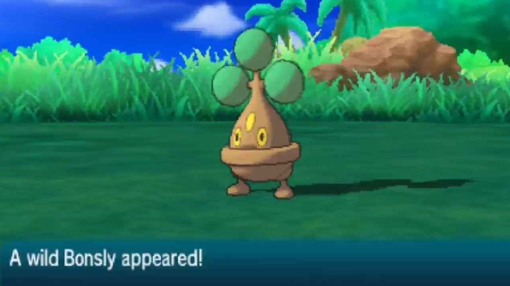
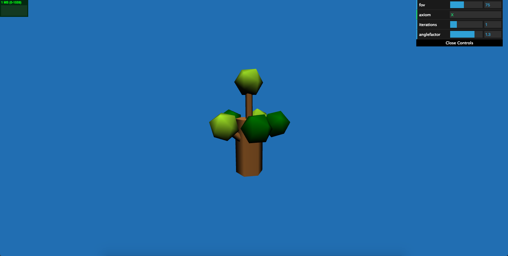
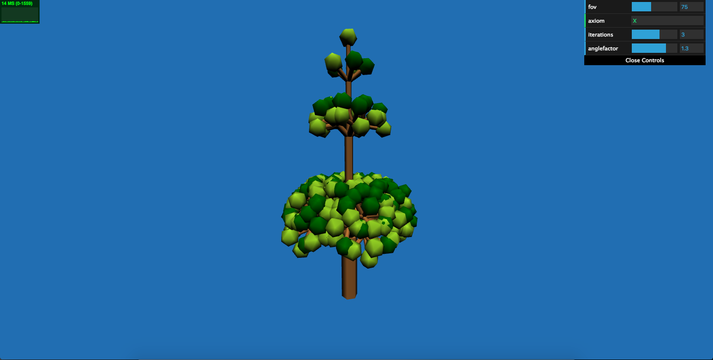
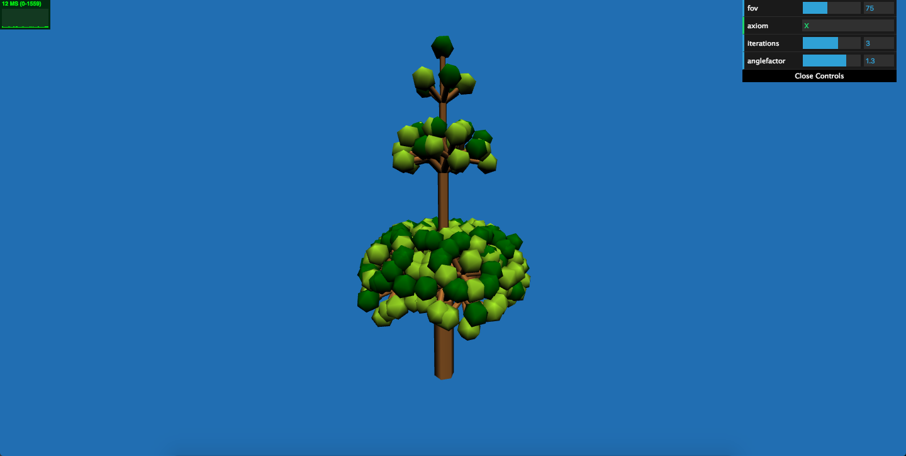
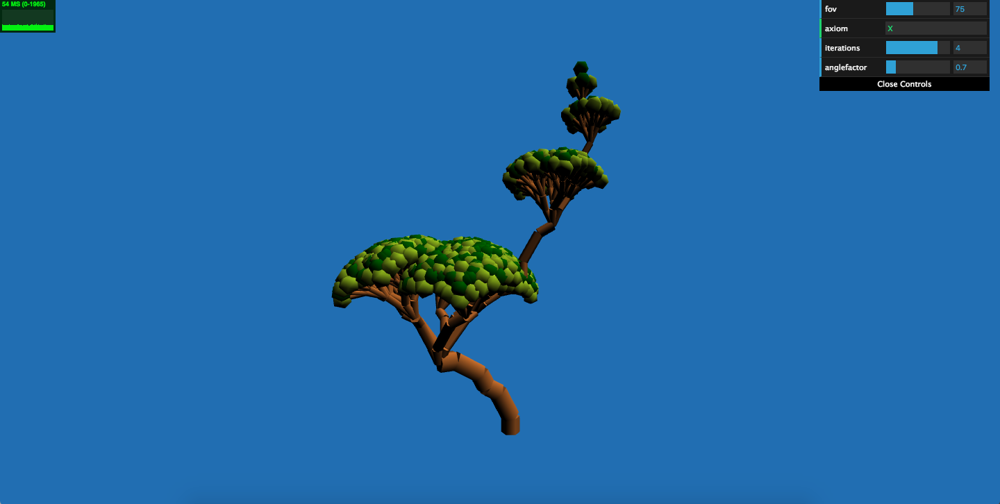
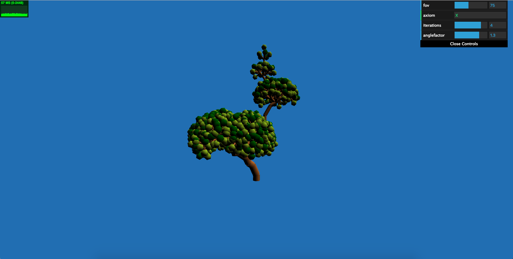

The objective of this assignment is to create an L System parser and generate interesting looking plants. Start by forking and then cloning this repository: [https://github.com/CIS700-Procedural-Graphics/Project3-LSystems](https://github.com/CIS700-Procedural-Graphics/Project3-LSystems)

For this project, I took inspiration from Low-Poly art (one of my favorite styles of art), and the Pokemon Bonsly. I wanted to simulate what it would look like for a tree like Bonsly to grow up. I originally kept the tree symmetrical about the y-axis because it looks more visually appealing to me, but I later added some twisting to the trunk to make it more dynamic. I changed the color of the light to a warm peach color to make the tree seem more "friendly."

## Turtle

I rewrote the turtle class so that the turtle had a local forward, up, and left axes. This allowed me to create the symmetric effect of the tree.

In addition to operations for `[` and `]`, I invented the operations:
	'&' : rotate the turtle along its forward vector (main trunk)
	'$' : rotate the turtle along its up vector (trunk bending),
    '%' : rotate the turtle along its up vector (trunk bending),
	'X' : draw a branch if iteration ends
	'A' : draw a branch if iteration ends
    'S' : make a bright-colored leaf
    'D' : make a dark-colored leaf

## Interactivity

Aspects of my demo that is interactive:
1. the axiom
2. number of iterations
3. the angle of rotation of the turtle (branches only)

##Grammar Features

1. The farther the branch from ground, the thinner it is.
2. Leaves bunch up in "levels."
3. Leaves are ONLY created at the ends of the branches.
4. Randomized leaf color between 2 colors.
5. Branch twisting between "levels" of leaf bunches
5. Randomized branch twisting.

##Design Process

