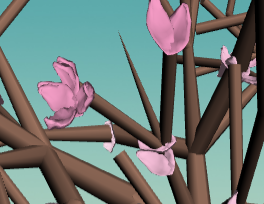

# L-System Parser- Cherry Blossom Tree

I have implemented an L-system parser as well as a grammar to create a cherry blossom tree. It can be found at https://tabathah.github.io/Project3-LSystems. Below are some shots of the final product.

**Grammar**

I started with the axiom "FFFFFX" so that there would be a tall trunk before the tree began branching. I basically had two different letters that had rules so that they branched in different ways. "X" creates longer and more spread out branches with respect to their root, whereas "B" creates shorter branches that point in mostly the same directions, similarly to the way branches expand when you get to smaller parts of the tree, farther away from the initial trunk. The rules for "X" gava a high probability that more "X" branchings would occur and a low probability that "B" branchings would occur. Thus, the tree should usually do a lot of long and varied branching before starting to do smaller and pointed branches. However, since there is a small probability that on the first iteration a "B" branch will occur, the results of the L-system can vary widely. Here is the difference between an "X" branching occurring at the first iteration and a "B" branching occurring at the first iteration, respectively:

  

Another difference in features between "X" and "B" branches is that "B" branches include many more instances of flowers and pointed branches, given by the letters "C" and "P", respectively. I created a model for a flower petal in Maya and imported it using an OBJ loader. I then chose a random number between 1 and 6 to dictate how many petals would be on a particular flower. I then rotated the petals such that they would be layered in a similar way to cherry blossoms. For the pointed branches, I placed cones, rather than cylinders. Here is a close-up of some pointed branches and flowers: 

 

Here is a front and top view of the completed grammar at the fourth iteration. (Note: the fourth iteration is normally the msot realistic one):

 

Again, even in later iterations, the result is very different if the first iteration was a "B" branching. Here is such an example at the fourth iteration:

**Some Additions**

After getting the grammar the way I wanted it, I added a few things to make the result look more like a tree. 

First, I decided to make the widths of the branches inversely related to the iteration that the branch was added to the l-system. I took account of this in the Node class by holding it as a variable. I then kept current iteration as a variable in the turtle class as well as next iteration, the iteration of the next branch to come, so that I could create the cylindrical branches so that they thin as they get to smaller sized branches. The following was the result:

I then decided that the first cylinder in the trunk of the tree should probably meet the ground with a larger radius than the rest of the trunk, so I changed the axiom to "TFFFFX" and parsed T to create a thicker based cylinder. This gave the following result:

 

Finally, I felt like the constant pink of the flowers so a bit off-putting so I created a shader that would make a gradient of flower colors from white to pink as the petals got farther away from the base of the tree. Here is the result:

A last small detail was adding in the petals which come across the screen on a routine. I randomly offset starting positions for about 30 flower petals from a grid above the tree offscreen. I then had their x and y positions move a little every time the tick() function was called so they would float across the screen. I also randomly rotated them to make the wind look more realistic. 

**Interactivity**

The GUI includes modifiers to change the axiom of the L-system, the number of iterations that the grammar should be parsed, the probabiltiy that x branching vs b branching will occur, and the width of the branches. Here are some shots of different results after changing the width values:

  

