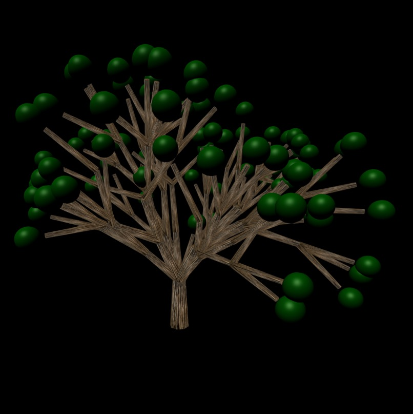

# [L System Tree](https://anvidalal.github.io/LSystems/)

## Objective

Learn L Systems by making trees.

## Process

I started off by writing a doubly linked list to represent my L-System. Once  had that down, I introduced the variable of iteration to see what my tree would look like at different steps. 

Next, I added width to my tree, such that it was inversely proportional to the iteration. 

I added texture to my branches to make it look more like a tree. 

I then played altered how my width changes with each iteration. 

Finally I added leaves to every branch in my linked list that was at the last iteration. 

After some tweaks in the grammar, I was able to achieve some really random looking trees. 

